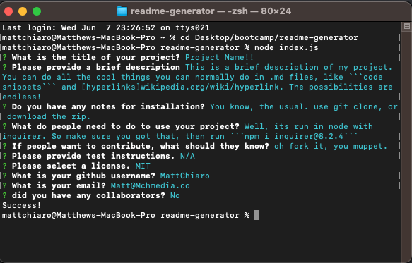

# readme-generator

## Description
         
The purpose of this project was to create a CLI application to generate professional README files quickly. Upon running the application you will be prompted for different inputs for each piece of the README. Once completed, the application automatically takes your data and organizes it in markdown. This file is then saved as ```README.md```. You know it works, because this README was generated with it! :)

## Installation

Clone the repository from github using ```git clone https://github.com/mattchiaro/readme-generator.git``` or download it as a ZIP file.

## Usage
 Upon downloading, run ```npm i inquirer@8.2.4``` to install all necessary node modules.

from the command line within your repo, run ```node index.js```. Follow the prompts and you are done!





## License


https://opensource.org/licenses/MIT

## How to Contribute

Feel free to contribute by forking the repository on github.

## Questions/Contact

If you have any questions, please contact me at Matt@MchMedia.co. You can also find me on GitHub at [MattChiaro](github.com/MattChiaro).

